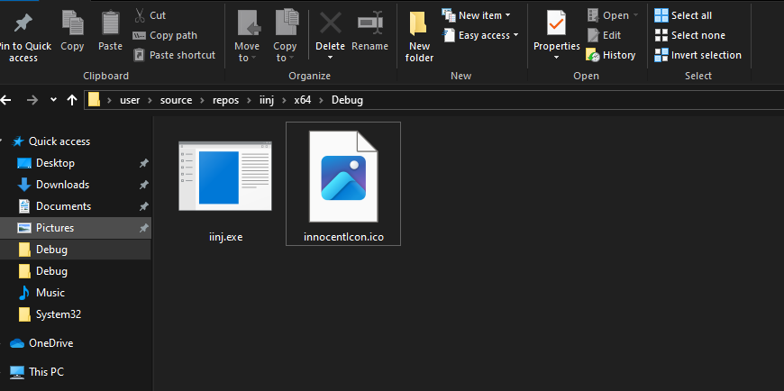
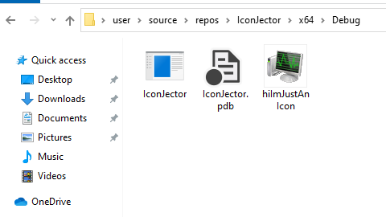
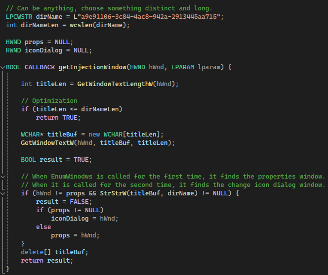
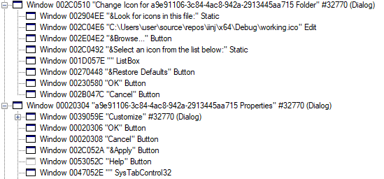

<p align="center">
    
</p>

## IconJector
This is a Windows Explorer DLL injection technique that uses the change icon dialog on Windows. 

It can trick users into loading a malicious DLL into their explorer process:

https://github.com/0xda568/IconJector/assets/61665703/06428402-764c-4279-b762-1d01082552c8

Additionally, it can be used to to inject a DLL from another process into the explorer:

https://github.com/0xda568/IconJector/assets/61665703/bbf53775-ad8d-422b-b186-663ff5074976

## How does it work?
Beside containing code, DLLs are also used to store resources like icons. In the demonstration you can see that the default icons are stored in shell32.dll:


_Actually, in modern Windows versions, they are stored in [shell32.dll.mui](https://superuser.com/questions/1480268/icons-no-longer-in-imageres-dll-in-windows-10-1903-4kb-file), but it is still displayed as shell32.dll_

For the explorer process to be able to display all of the icons that are stored in the DLL in the dialog, it needs to load the DLL into memory so that it can be parsed.

Furthermore, DLLs in Windows have the ability do define an optional [DllMain](https://learn.microsoft.com/en-us/windows/win32/dlls/dllmain) function, which is called when the DLL is loaded or unloaded using the LoadLibrary and FreeLibrary functions.

```cpp
BOOL WINAPI DllMain(
    HINSTANCE hinstDLL,  // handle to DLL module
    DWORD fdwReason,     // reason for calling function
    LPVOID lpvReserved )  // reserved
{
    // Perform actions based on the reason for calling.
    switch( fdwReason ) 
    { 
        case DLL_PROCESS_ATTACH:
         // Initialize once for each new process.
         // Return FALSE to fail DLL load.
            break;

        case DLL_THREAD_ATTACH:
         // Do thread-specific initialization.
            break;

        case DLL_THREAD_DETACH:
         // Do thread-specific cleanup.
            break;

        case DLL_PROCESS_DETACH:
        
            if (lpvReserved != nullptr)
            {
                break; // do not do cleanup if process termination scenario
            }
            
         // Perform any necessary cleanup.
            break;
    }
    return TRUE;  // Successful DLL_PROCESS_ATTACH.
}
```

This means that if a DLL with a DllMain functions is loaded by the explorer, the code defined in the DllMain function will execute in the explorer's memory.

And this is exactly what is being done here. In addition to that, the DLL is being disguised as an icon:

## The icon
The "icon" is actually a simple DLL file with an .ico extension that opens the calculator app with an icon resource that was added using the [Resource Hacker]("https://www.angusj.com/resourcehacker/"). _(The icon can also be added in Visual Studio)_

There are some anomalies when it comes to the appearance of the icon in the folder view. I have tested this on two different Windows 10 versions (the newest and an older one) and on Windows 11.

### Windows 10
On both of the Widnows 10 versions, the icon stored inside the DLL was not displayed when the extension was changed to .ico



On the newest Windows 10 version, however, it did work until I tried to open the "icon" inside of the photo app. Since then, I have not been able to recreate it.



### Windows 11
On Windows 11, the disguised DLL was displayed just like a normal icon in the Explorer view. When it is opened in the photo app, however, an error is displayed.


https://github.com/0xda568/IconJector/assets/61665703/748c1012-1d2c-47dd-915f-860ffc6d1b05

## Inject a DLL programtically
Beside tricking a user to load the DLL manually, an attacker also has the option to use this technique to inject a DLL file into the explorer process programtically:

Firstly, a folder is created in the temp directory, and the properties of the folder are opened using SHObjectProperties. To retrieve the handle of the window independently of the system language, EnumWindows is used with a callback function that checks for the distinct folder name in every open window. 

 

Through the properties page, the change icon dialog is invoked, whose handle is also retrieved with EnumWindows. Lastly, the icon path is changed to a DLL (which has a .ico extension in this case), which causes the explorer to load the DLL after the OK button is pressed.

## Why?
This is a very stealthy way to inject a DLL into the Explorer process because it doesn't use the usual DLL-injection API. It does produce two short popups, which aren't too disturbing, however. So it can be used as an AV evasion technique by a threat actor to execute code through the legitimate explorer process or to load a UMD rootkit. 

Also, spreading DLLs masked as .ico files may be an interesting attack vector.

## Tools used
To get the right window handles, I used Spy++, which is a tool that gets installed with Visual Studio. 



## Credits
Many thanks to Bill G. from Microsoft for the beautiful folder icon!

Thank you, random guy on the internet, for the beautiful injection icon!
